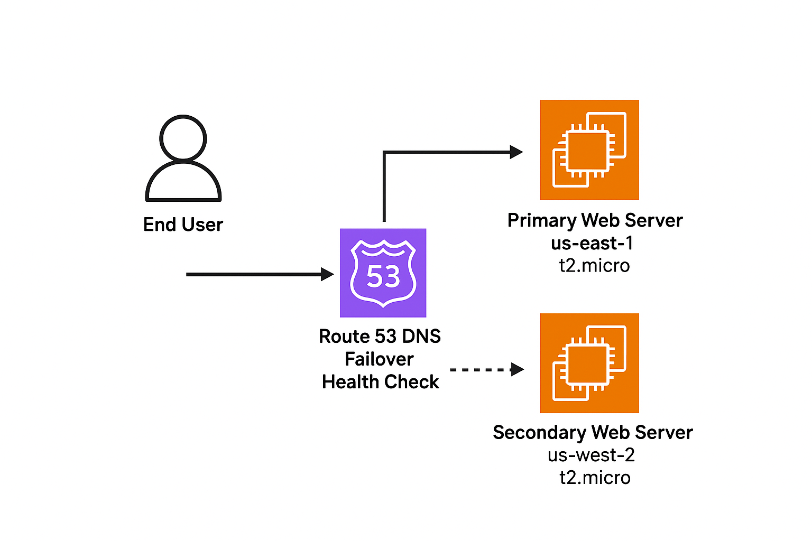
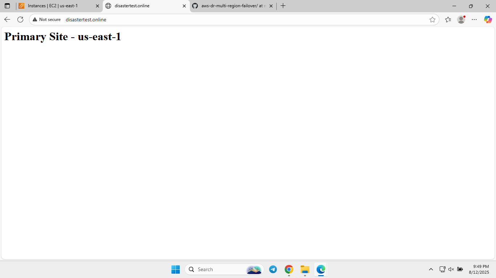
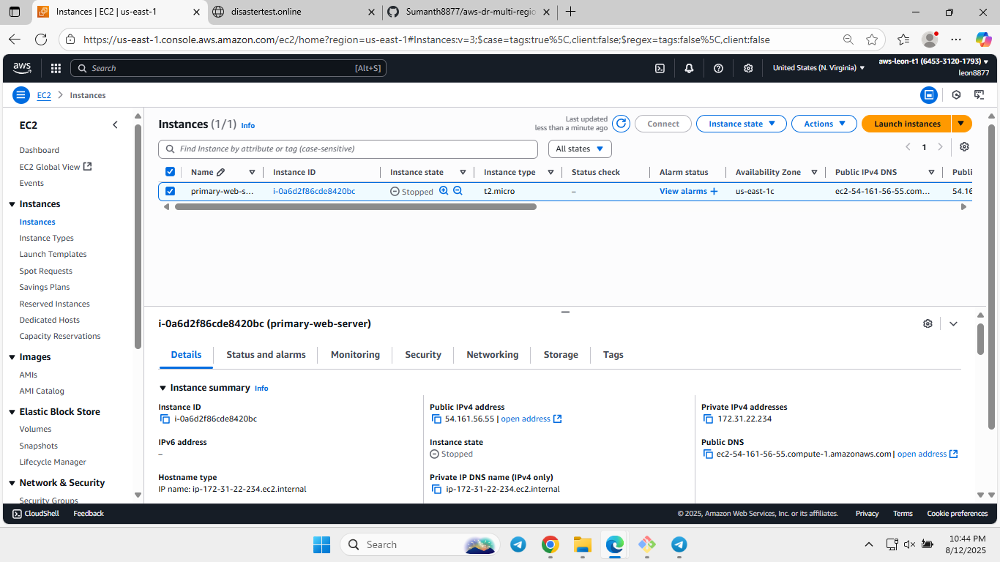
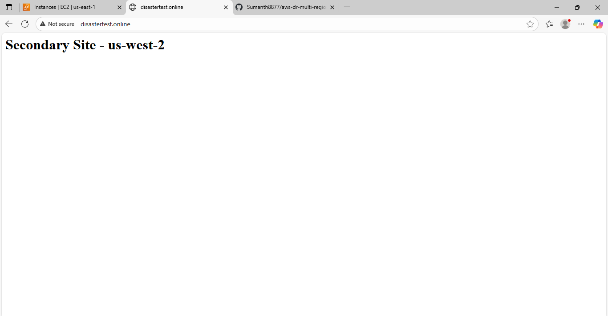

# AWS Disaster Recovery with Multi-Region Failover

## 📌 Overview
This project demonstrates an **AWS Disaster Recovery (DR)** setup with **multi-region failover** using Route 53 DNS health checks.  
It simulates a real-world production scenario where a web application in one AWS region automatically fails over to another region if the primary becomes unavailable.

## 🏗 Architecture


- **Primary Web Server**: EC2 instance in **us-east-1** (Virginia)  
- **Secondary Web Server**: EC2 instance in **us-west-2** (Oregon)  
- **Route 53 DNS Failover**: Directs user traffic to the healthy endpoint  
- **Health Check**: Monitors primary server's availability  
- **Elastic IPs**: Ensure static public IP addresses for both instances  

---

## 🚀 Implementation Steps

### **Step 1 – Planning and Setup**
- Created an AWS Free Tier account  
- Enabled billing alerts to avoid unexpected charges  
- Selected AWS regions for deployment:
  - Primary: **us-east-1**
  - Secondary: **us-west-2**

### **Step 2 – Deploy Primary EC2 Web Server**
- Launched EC2 (Amazon Linux 2, t2.micro) in **us-east-1**  
- Configure security group to allow **HTTP (port 80)** and **SSH (port 22)** access.
- Use the following **User Data** script during instance launch to install Apache and set a custom index page:
```bash
#!/bin/bash
yum install -y httpd
systemctl start httpd
systemctl enable httpd
echo "<h1>Primary Site - us-east-1</h1>" > /var/www/html/index.html
```

### **Step 3 – Deploy Secondary EC2 Web Server**
- Launch an EC2 instance (Amazon Linux 2, t2.micro) in **us-west-2**.
- Configure security group to allow **HTTP (port 80)** and **SSH (port 22)** access.
- Use the following **User Data** script during instance launch to install Apache and set a custom index page:
```bash
#!/bin/bash
yum install -y httpd
systemctl start httpd
systemctl enable httpd
echo "<h1>Secondary Site - us-west-2</h1>" > /var/www/html/index.html
```

### **Step 4 – Configure Route 53 with Failover**
- Register or use an existing domain (e.g., `disastertest.online`).
- In **Route 53**, create a hosted zone for your domain.
- Create a **fast (10-second)** health check for the primary EC2:
  - Protocol: HTTP  
  - IP: Primary EC2 Elastic IP  
  - Port: 80  
  - Path: `/`  
- Create DNS records:

**Primary Record**
- Name: yourdomain.com  
- Type: A  
- Value: Primary EC2 Elastic IP  
- Routing policy: Failover → Primary  
- Attach the health check to the primary record

### **Step 5 – Test Failover and Failback**
- Stop Apache on the primary EC2 to simulate a failure:
```bash
sudo systemctl stop httpd
```

Wait for Route 53 to detect the failure and route traffic to the secondary EC2 (should take ~40 seconds with a 10-second health check and 30-second TTL).

Test by visiting your domain - it should now display the secondary site.

Restart Apache on the primary EC2:
```bash
sudo systemctl start httpd
```

Once the health check passes, Route 53 will automatically route traffic back to the primary EC2.

## 🛠 Technologies Used
- Amazon EC2
- Route 53
- Elastic IP
- Apache Web Server

## 🧪 Test Results

**Primary Site (Healthy)**  


**Primary EC2 Stopped (Failover Triggered)**  


**Secondary Site (Failover Successful)**  


